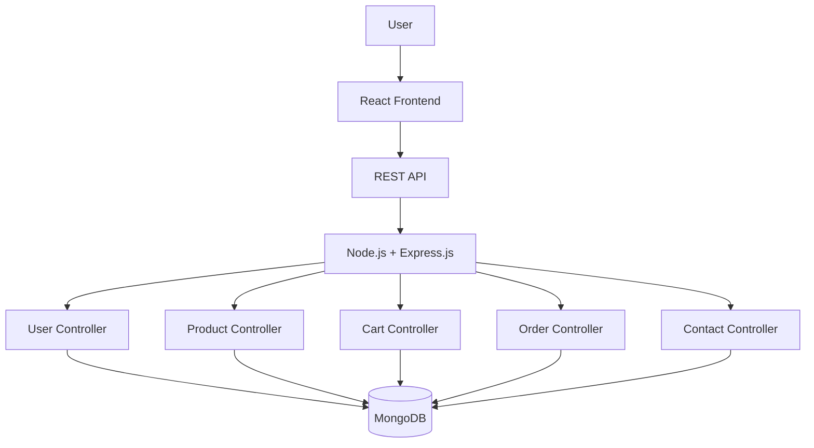

<div align="center">

# 🏔️ ExploreX

### Explore More. Experience More. Live the Adventure.

A full-stack outdoor adventure platform built with the **MERN stack**, designed to help users discover adventure experiences, explore products, manage their cart, and place orders through a modern web interface.

<br/>


</div>

---

## 📖 About ExploreX

**ExploreX** is a full-stack web application focused on outdoor adventure and exploration.

The application combines a responsive **React frontend** with a **Node.js + Express.js backend** and **MongoDB** database.

ExploreX follows a client-server architecture where the React application communicates with the backend through REST APIs for user, product, cart, order, and contact-related operations.

---

## ✨ Core Features

* 🔐 **User Management** — User-related functionality through dedicated APIs
* 🏕️ **Adventure/Product Exploration** — Browse available products and adventure offerings
* 🛒 **Shopping Cart** — Add and manage items in the user's cart
* 📦 **Order Management** — Backend support for creating and managing orders
* 📬 **Contact System** — Dedicated contact-us functionality
* 🖼️ **Product Images** — Static image serving through the Express backend
* 🗄️ **MongoDB Integration** — Persistent application data using MongoDB and Mongoose
* 🌐 **REST API Architecture** — Separate routes, controllers, and models
* ⚡ **React Frontend** — Component-based interactive user interface
* 🔧 **Environment Configuration** — Separate frontend and backend environment variables

---

## 📸 Project Screenshots

### 🏠 Home Page


### 🏕️ Explore / Products


### 🛒 Shopping Cart


### 🔐 Authentication


> **Note:** Add your actual application screenshots inside `assets/screenshots/` using the filenames shown above.

---

## 🛠️ Tech Stack

| Category                | Technologies                    |
| ----------------------- | ------------------------------- |
| **Frontend**            | React.js, JavaScript, HTML, CSS |
| **Backend**             | Node.js, Express.js             |
| **Database**            | MongoDB, Mongoose               |
| **API Architecture**    | REST APIs                       |
| **File Handling**       | Express File Upload             |
| **Development**         | Git, GitHub, npm                |
| **Frontend Deployment** | Vercel                          |
| **Backend Deployment**  | Render                          |
| **Cloud Database**      | MongoDB Atlas                   |

---

## 🏗️ System Architecture



### Request Flow

```text
User
  ↓
React Frontend
  ↓
HTTP Request
  ↓
Express Route
  ↓
Controller
  ↓
Mongoose Model
  ↓
MongoDB
  ↓
JSON Response
  ↓
React UI
```

---

## 📁 Project Structure

```text
ExploreX/
│
├── backend/
│   │
│   ├── connection/
│   │   └── db.connect.js
│   │
│   ├── controller/
│   │   ├── cartController.js
│   │   ├── contactUsController.js
│   │   ├── orderController.js
│   │   ├── productController.js
│   │   └── userController.js
│   │
│   ├── model/
│   │   ├── cartModel.js
│   │   ├── contactUsModel.js
│   │   ├── orderModel.js
│   │   ├── productModel.js
│   │   └── userModel.js
│   │
│   ├── routes/
│   │   ├── cartRoute.js
│   │   ├── contactUsRoutes.js
│   │   ├── orderRoute.js
│   │   ├── productRoute.js
│   │   └── userRouter.js
│   │
│   ├── public/
│   │   └── images/
│   │
│   ├── .env
│   ├── package.json
│   └── server.js
│
├── frontend/
│   │
│   ├── public/
│   │
│   ├── src/
│   │   ├── components/
│   │   ├── Context/
│   │   ├── App.js
│   │   └── index.js
│   │
│   ├── .env
│   └── package.json
│
├── assets/
│   └── screenshots/
│
├── .gitignore
└── README.md
```

---

## 🚀 Getting Started

### Prerequisites

Make sure you have installed:

* Node.js
* npm
* MongoDB, or access to MongoDB Atlas
* Git

---

## 📥 1. Clone the Repository

```bash
git clone <your-repository-url>
cd ExploreX
```

---

## ⚙️ 2. Backend Setup

Navigate to the backend:

```bash
cd backend
```

Install dependencies:

```bash
npm install
```

Create a `.env` file:

```env
PORT=3333
MONGOURI=your_mongodb_connection_string
```

Add any additional environment variables required by your local version of the project.

> Never commit your real `.env` file, MongoDB credentials, passwords, or secret keys to GitHub.

Start the backend:

```bash
npm start
```

The backend should run at:

```text
http://localhost:3333
```

---

## 💻 3. Frontend Setup

Open another terminal:

```bash
cd frontend
```

Install dependencies:

```bash
npm install
```

Create:

```text
frontend/.env
```

and add:

```env
REACT_APP_BACKEND_URL=http://localhost:3333
```

Start the React application:

```bash
npm start
```

The frontend should run at:

```text
http://localhost:3000
```

---

## 🔌 Backend Routes

ExploreX separates backend functionality into dedicated routers:

| Router         | Purpose                  |
| -------------- | ------------------------ |
| `/user`        | User-related operations  |
| `/contactUs`   | Contact form operations  |
| Product Router | Product operations       |
| Cart Router    | Shopping cart operations |
| Order Router   | Order operations         |

The exact endpoint paths are defined inside their respective files in:

```text
backend/routes/
```

---

## 🗄️ Database Connection

ExploreX uses **MongoDB with Mongoose**.

The database connection is handled inside:

```text
backend/connection/db.connect.js
```

The application reads the connection URI from:

```javascript
process.env.MONGOURI
```

Example:

```env
MONGOURI=mongodb://127.0.0.1:27017/explorex
```

For production, use a secure MongoDB Atlas connection string through the deployment platform's environment variables.

---

## 🌐 Deployment Architecture

```text
                    INTERNET
                        │
                        ▼
               ┌─────────────────┐
               │     Vercel      │
               │ React Frontend  │
               └────────┬────────┘
                        │
                     HTTPS
                        │
                        ▼
               ┌─────────────────┐
               │     Render      │
               │ Express Backend │
               └────────┬────────┘
                        │
                        ▼
               ┌─────────────────┐
               │ MongoDB Atlas   │
               │    Database     │
               └─────────────────┘
```

### Frontend

Deploy the React application using **Vercel**.

Production environment variable:

```env
REACT_APP_BACKEND_URL=https://your-backend.onrender.com
```

### Backend

Deploy the Express API using **Render**.

Typical configuration:

```text
Root Directory: backend
Build Command:  npm install
Start Command:  npm start
```

Configure MongoDB and other secrets through Render's Environment Variables section.

### Database

Use **MongoDB Atlas** for the production database.

---

## 🔐 Security

Sensitive values should never be committed to GitHub.

Keep files such as these ignored:

```gitignore
.env
.env.local
node_modules/
*.log
```

Store production credentials using Vercel/Render environment variables.

---

## 🧪 Backend Health Check

After starting the backend, you can verify that the server is running by visiting:

```text
http://localhost:3333
```

A configured health endpoint can return:

```json
{
  "success": true,
  "message": "ExploreX backend is running"
}
```

---

## 🔮 Future Improvements

ExploreX can be extended with:

* 💳 Online payment integration
* ⭐ Adventure/product reviews and ratings
* ❤️ Wishlist functionality
* 🔎 Advanced search and filtering
* 📍 Location-based adventure discovery
* 🗺️ Interactive maps
* 📅 Real-time adventure availability
* 🔔 Booking notifications
* 📊 Admin analytics dashboard
* ☁️ Cloud-based image storage
* 🤖 Personalized adventure recommendations
* 📱 Progressive Web App support

---

## 🎯 Project Goals

ExploreX demonstrates practical full-stack development concepts including:

* Component-based frontend development
* REST API development
* Client-server communication
* MVC-style backend organization
* MongoDB database integration
* Environment-based configuration
* Cart and order workflows
* Full-stack deployment architecture

---

## 👨‍💻 Author

### Rajshekhar Pandey

Built with a focus on full-stack development, REST APIs, database integration, and modern web application architecture.

---

<div align="center">

## ⭐ Support ExploreX

If you found this project useful or interesting, consider giving the repository a **⭐ Star**.

### 🏔️ ExploreX

**Discover. Explore. Experience.**

</div>
